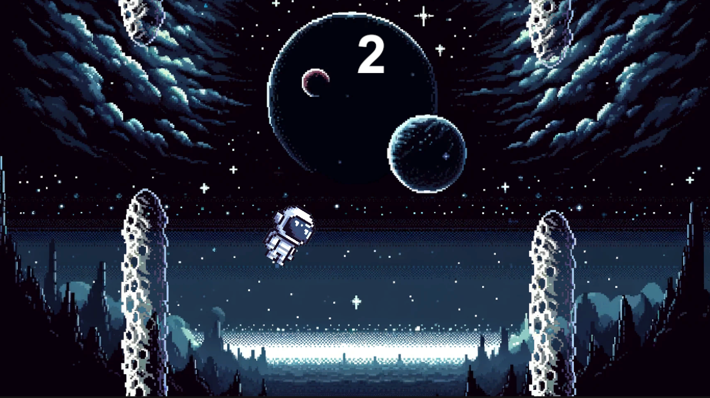
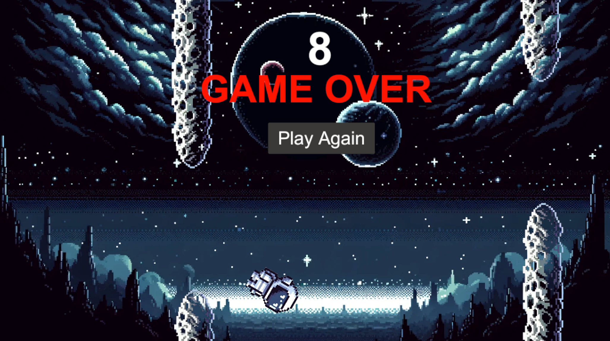

## Introduction
Simple Flappy Birds game clone.

## Game Screenshots

## Installation
To install and play the game, follow these simple steps:

1. Clone the repo.
2. Add the project in Unity Hub.
3. In Assets go to -> Scenes drag and drop SampleScene into the hierarchy.
4. Press Play button to play in Unity or file -> build settings -> click windows then build and run

